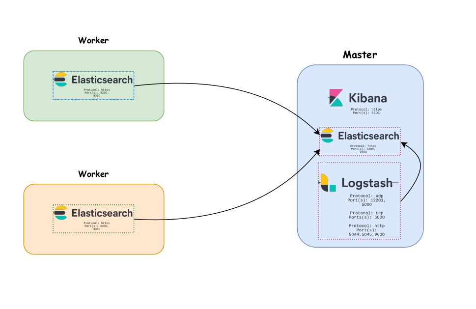

# Master Stack

This compose file is for master node


# elk-tls-docker



This docker-compose project will assist with setting up and creating a ELK stack using either self-signed TLS certificates or using LetsEncrypt certificates for communications.  In general you get HTTPS for all services.


## Environment Details

This project was built so that you can test and use built-in features under Elastic Security, like detections, signals, cases, and other features.

This docker-compose project will create the following Elastic containers based on version 7.14.1:

* Elasticsearch
* Logstash
* Kibana


## Setup

In order to use this project, you must first include the following in a file named `.env`. I have provided an example environment variable file here [.env-example](https://github.com/swimlane/elk-tls-docker/blob/master/.env-example).

> Copy or create your own `.env` from the provided example or from the code block below

```text
ELK_VERSION=7.14.1
ELASTIC_USERNAME=elastic
ELASTIC_PASSWORD=some_password

# Configuration Variables
ELASTICSEARCH_HEAP=2g
LOGSTASH_HEAP=1g
PACKETBEAT_HEAP=256m
FILEBEAT_HEAP=256m
METRICBEAT_HEAP=256m
XPACK_ENCRYPTION_KEY=somesuperlongstringlikethisoneMQBbtsynu4bV2uxLy

# Self signed TLS certificates
CA_PASSWORD=some_password
CA_DAYS=3650
ELASTIC_DIR=/usr/share/elasticsearch
LOGSTASH_DIR=/usr/share/logstash
KIBANA_DIR=/usr/share/kibana
PACKETBEAT_DIR=/usr/share/packetbeat
FILEBEAT_DIR=/usr/share/filebeat
METRICBEAT_DIR=/usr/share/metricbeat


# nodes ip (change them)#
NODE1_IP=1.2.3.4
NODE2_IP=1.2.3.4
NODE3_IP=1.2.3.4

# Letsencrypt certificates
## Setting STAGING to true means it will generate self-signed certificates
## Setting STAGING to false means it will generate letsencrypt certificates
# STAGING=false
STAGING=true

# swag Configuration
#DOMAIN=mydomain.com
#SUBDOMAIN=kibana
#SUBFOLDER=kibana
#EMAIL=email@email.com
#TIMEZONE=America/Chicago
```

> Note: You may need to change the size of the HEAP variables in the above configuration file based on your system requirements.  The settings present are for a machine with 8GB of memory


## Creating Keystore for self-signed certificates

By default creation of self-signed certificates is used and makes the most sense when testing out this project.  To do so you simply run the following command first:

```bash
docker-compose -f docker-compose.setup.yml run --rm certs
```

> Note: You should move generated certificates to all worker nodes with scp 

```
scp -r secrets/ user@1.2.3.4:/path/of/near/compose/file
```
## Creating Keystore & Certificates for production

If you are wanting to deploy this project in a production like environment, please see our documentation [Setup using Letsencrypt](https://github.com/swimlane/elk-tls-docker/wiki/Setup%20using%20Letsencrypt).


## Running a development environment

Now, that you have your keys/certs and [passwords](https://github.com/swimlane/elk-tls-docker/wiki/Setting%20Passwords) set we can then just restart the containers by running:

```
docker-compose up -d
```